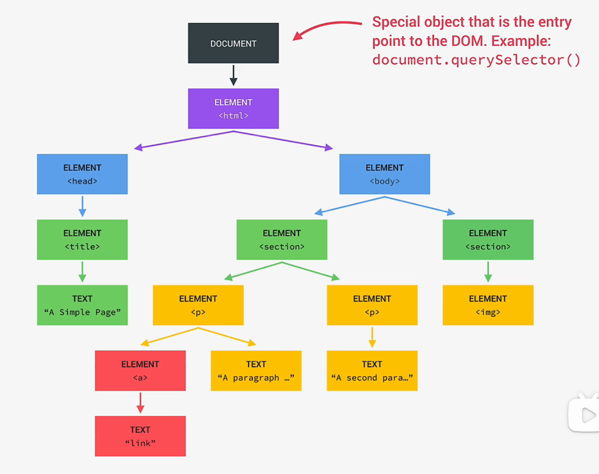
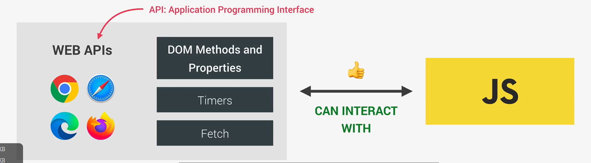

<!--
 * @Author: _krill
 * @Date: 2022-07-19 17:06:52
 * @LastEditTime: 2022-07-19 19:17:04
 * @Description: 
-->

# DOM (Document Object Model)

DOM 包含 HTML 中的所有元素。

DOM 是 Web API 的一部分，不属于 JavaScript，浏览器中实现了一个 DOM 的官方规范，所以 DOM 在所有浏览器中的操作都是一致的。

