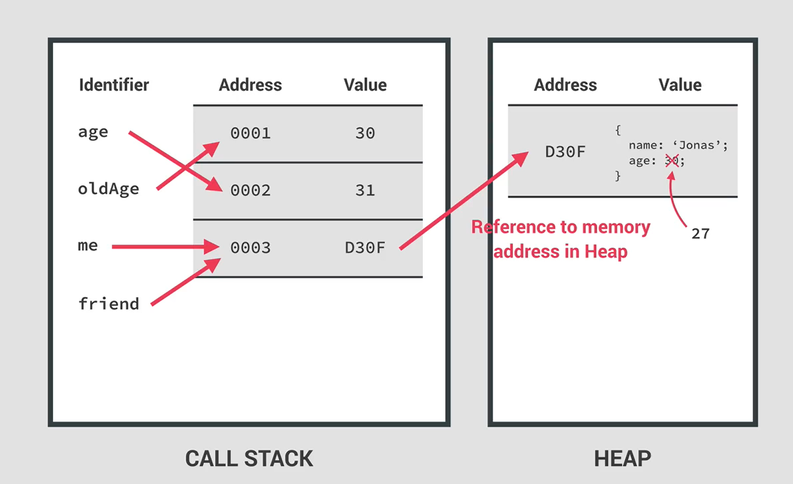

<!--
 * @Author: _krill
 * @Date: 2022-07-22 15:51:27
 * @LastEditTime: 2022-07-25 16:08:37
 * @Description: 
-->

# Js 工作原理

## 八大特性

### 1. High-level

Js 是一门高级编程语言，无需手动管理资源

### 2. Garbage-collected 垃圾自动回收机制

### 3.  just-in-time complied 即时编译

现代 Js 不是一门纯解释型语言，而是 JIT 即时编译，混合了编译型和解释型。这种方式会定期提前编译，但没有生成可执行二进制文件，而是在编译后立即执行。

**步骤**

1. **Parsing 解析** 首先代码在 Js 引擎中解析成抽象语法树或 AST 这样的数据结构，解析会将代码拆解成小的片段并且检查语法错误。

2. **Compilation 编译** 将代码翻译成机器指令

3. **Execution 执行** 生成的机器指令立刻在调用栈中被执行

**编译和执行循环往复**

第二步并没有一次性将代码翻译成最终的机器指令，在第三步程序运行期间代码还会再回到第二步重新编译优化。


### 4. Multi-paradigm 多范式

Js 是一门多范式编程语言，一种范式决定了编程风格和技术，目前主流的三种范式是面向过程、面向对象（OOP）、函数式编程（FP）

### 5. First-class functions

Js 中函数可以被当作值使用，这是支持函数式编程的重要特性

### 6. Dynamic 动态的

Js 是动态编程语言，变量类型在运行时才确定，并且可以改变。(弱类型)

### 7. Single-threaded 单线程

### 8. Non-blocking event loop 非阻塞事件循环并发模型

并发模型——同时处理多个事件

## Js 引擎 & Runtime

### Js 引擎

> Js 引擎是执行 Js 代码的计算机程序，每个浏览器都有一个 Js 引擎，比如 Chrome 的 V8 引擎。

引擎一般由两个部分组成，调用栈(call stack)和堆(heap)，调用栈是代码实际执行的地方(execution context 执行上下文)，堆是一个非结构化的内存池，存储了我们程序所需要的所有对象。

### Runtime

Runtime 就像是一个巨大的容器，包括了运行 JS 需要的一切内容，Js 引擎、WEB APIs/Node.js、回调队列


## Call Stack & Execution Contexts 调用栈和执行上下文

### Execution Context

执行上下文可以看作一个执行一段 JS 代码的环境，其包含所有执行这段代码需要的内容，每个函数都有一个执行上下文。

在编译结束开始执行时，首先会创建一个全局执行上下文，里面放着所有函数外的代码（函数只有在调用时执行）作为顶级代码（top-level code），其执行优先级最高。**一个 JS 项目有且仅有一个全局执行上下文，全局执行上下文在程序运行期间将会始终在调用栈中。**

EC 中包括三个部分：

##### 1. variable environment 变量环境

- let, const and var declarations

- functions

- arguments object 参数对象

**Hoisting and the TDZ 吊装和时间死区**

hoisting: 让某些变量在定义前可以使用和访问，也可以称为变量提升。

下图即函数定义、var、let 和 const、函数表达式和箭头函数，函数定义会被提升，为块作用域。

要注意的是，尽管 var 定义的变量会被提升，但若在定义前访问其值为 undefined，为函数作用域。var 的提升是个副作用

函数表达式和箭头函数实际上看作值来处理，其是否被提升取决于如何定义变量。

JS 中使用 Hoisting 其一是为了在函数定义前能先调用函数，便于如相互递归的场景。


TDZ: 即在块作用域内，变量定义前的部分为 TDZ，此时不能访问和使用变量，严格来说，变量的作用域范围为从该变量定义开始到当前块作用域结束。

ES6 引入 TDZ 一是为了更好地避免和捕获错误，确保每一个值先定义后使用，二是因为 const，const 定义的变量必须初始化并且之后不能改变其值，如果允许块作用域先使用，那么值就为 undefined，显然不合理。 

##### 2. scope chain 作用域链


作用域链只能向上工作，不能向下或横向工作。这意味着子级作用域可以向上寻找并使用父级的变量，但父级不能访问子级作用域的变量，并且同级作用域的变量不能相互访问。

ps. 作用域链和调用栈中函数的顺序无关

eg.


**三种作用域类型**

- global scope

- function scope

    var 是函数作用域

- block scope(ES6)

    let、const 都是块作用域的，在严格模式下，函数也是块作用域

##### 3. this keyword

this 关键字是一个为每个执行上下文（函数）创建的特殊变量，它指向函数的所有者。this 关键字不是静态的，它的值在函数实际被调用时才能确定。

this 关键字在函数中一般有如图四种情况，第一是在对象的函数中，此时 this 的值为该函数所属的对象，可以在函数中通过 this 调用对象的属性；第二是普通的函数调用，此时如果是严格模式，this 的值为 undefined，否则为 全局窗口对象；第三是箭头函数，箭头函数本身不包含 this 关键字，如果调用则为其父级函数的 this 关键字；第四是创建监听器时，此时 this 的值为 DOM元素。


this 关键字永远不会指向函数，也永远不会指向 variable environment 变量环境

eg.
```js
'use strict'

> console.log(this);
<· // 全局窗口对象

> const calcAge(birthYear) {
    console.log(this);
    return 2037 - birthYear;
}
> calcAge(2002);
<· undefined // 如果不是严格模式，this 为全局窗口对象

// 箭头函数
> const calcAgeArrow = birthYear => {
    console.log(this);
    return 2037 - birthYear;
}
> calcAgeArrow(2002);
<· // 全局窗口对象

// this 关键字指向调用该方法的对象
> const gerry = {
    birthYear: 2002,
    calcAge: function () {
        console.log(this);
        return 2037 - this.birthYear;
    }
}
> gerry.calcAge();
<· // 打印 gerry 这个对象，即该函数的所有者

// 对象间的函数借用
> const jonas = {
    birthYear: 2012,
}
> jonas.calcAge = gerry.calcAge();
> console.log(jonas.calcAge());
<· // 打印 jonas 这个对象 
<· 25

> const f = gerry.calcAge;
> f();
<· undefined
<· // 显示 birthYear 未定义
```

> note: 箭头函数的执行上下文没有 arguments object 和 this 关键字，但可以使用它们父级常规函数的参数对象和 this 关键字

## 基本类型和引用类型



实现复制对象

```js
// 浅拷贝
// 合并两个对象并返回新的对象，只能用于第一层，如果对象的属性中存在对象，则仍然会复制引用
const gerryCopy = object.assign({}, gerry);

// 若要实现深度拷贝，借助外部库如 Lo-Dash
```