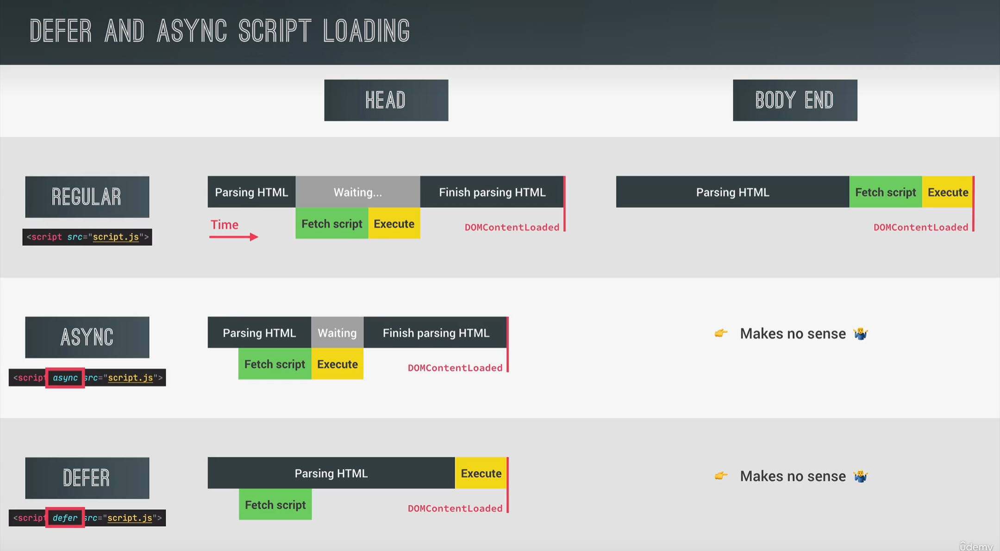

<!--
 * @Author: _krill
 * @Date: 2022-08-10 14:57:40
 * @LastEditTime: 2022-08-11 14:48:28
 * @Description: 
-->

# DOM 高级操作

P185 How the DOM really works

DOM 基本上是所有 JavaScript 代码和浏览器之间的接口，HTML document 由浏览器渲染。

## DOM tree


## 选择、创建、删除元素

### 选择元素

```js
// 选择元素
console.log(document.documentElement); // document 元素 整个 HTML
console.log(document.head);;
console.log(document.body);
// 选中子元素
const header = document.querySelector('.header');
document.querySelectorAll('.section');
// 根据 ID 获取元素
document.getElementById('section--1');
// 得到一个 collection 会自动更新
document.getElementsByTagName('button');
// 按类名获取元素 得到一个 collection
document.getElementsByClassName('btn');
```

### 创建和插入元素

```js

// 创建和插入元素
// .insertAdjacentHTML
// message 仅代表一个 DOM 元素的对象
const message = document.createElement('div');
message.classList.add('cookie-message');
// message.textContent = 'we use cookied for improved functionality and analytics.';
message.innerHTML =
  'we use cookied for improved functionality and analytics. <button class="btn btn--close-cookie">Got it!</button>';

// prepend 作为第一个节点追加
header.prepend(message);
// append 作为最后一个节点追加
header.append(message);
// 多个相同节点对象需要克隆
// header.append(message.cloneNode(true));
// header.before(message);
// header.after(message);
```

### 删除元素

```js
// 删除元素
document.querySelector('.btn--close-cookie')
  .addEventListener('click', function () {
    // now
    message.remove();
    // before
    // message.parentElement.removeChild(message);
  });
```

## Styles & attributes & classes 类型、属性和类

### CSS Styles

```js
message.style.backgroundColor = '#37383d';
message.style.width = '120%';
// nothing 只能获取到内联属性的值,不能直接获取到隐藏在类中的样式
console.log(message.style.height);
// 获取元素 message 的所有属性
console.log(getComputedStyle(message).height);
// 单个元素的样式修改
message.style.height = Number.parseFloat(getComputedStyle(message).height) + 30 + 'px';
// 全局的样式修改(主题色
document.documentElement.style.setProperty('--color-primary', 'orangered');
```

### Attributes

```js
// Attributes
const logo = document.querySelector('.nav__logo');
// 获取标准定义的属性
console.log(logo.alt);
// 绝对路径
console.log(logo.src);
// 相对路径 属性名称
console.log(logo.getAttribute('src'));
// Non-standard
console.log(logo.designer); // undefined
console.log(logo.getAttribute('designer')); // Gaffey
logo.setAttribute('company', 'Bankist');

// Data Attributes
// HTML 中属性名称: data-version-number
console.log(logo.dataset.versionNumber);
```

### Classes

```js
logo.classList.add('c', 'fake class name');
logo.classList.remove('c');
logo.classList.toggle('c');
logo.classList.contains('c');
// 覆盖原值
logo.className = 'jonas';
```

## 滚动特效

点击链接/按钮后平滑滚动到其他界面

```js
const btnScrollTo = document.querySelector('.btn--scroll-to');
const section1 = document.querySelector('#section--1');

btnScrollTo.addEventListener('click', function (e) {
  const slcoords = section1.getBoundingClientRect();
  console.log(slcoords);
  // 当前坐标 左上
  console.log(window.pageXOffset, window.pageYOffset);
  // slcoords.top 基于当前视角而非整个界面
  // window.scrollTo(slcoords.left, slcoords.top);
  // window.scrollTo(slcoords.left + window.pageXOffset, slcoords.top + window.pageYOffset);
  
  // old way
  window.scrollTo({
    left: slcoords.left + window.pageXOffset,
    top: slcoords.top + window.pageYOffset,
    behavior: 'smooth'
  });
  // modern way 现代浏览器支持
  section1.scrollIntoView({ behavior: 'smooth' });

})
```

## Types of events and event handles

### 基本

```js
// mdn javascript events
const h1 = document.querySelector('h1');

const alertH1 = function(e) {
  alert("addEventListener: Great! You're reading the heading :D");
  
  // 1. 移除事件监听
  h1.removeEventListener('mouseenter', alertH1);
};

h1.addEventListener('mouseenter', alertH1);

// 2. 定时删除
setTimeout(() => h1.removeEventListener('mouseenter', alertH1), 1000 * 3);
// h1.onmouseenter = function(e) {
//   alert("onmouseenter: Great! You're reading the heading :D");
// };
```

### Bubbling and Capturing 冒泡和捕获阶段 / 事件传播

**不是所有的事件都有冒泡和捕获阶段，默认情况下事件监听器只监听冒泡阶段的事件**

1. Capturing phase 事件从 DOM 树的根节点向下传播，将通过目标元素的每一个父元素直到到达目标元素。

一般在捕获阶段事件处理器不会接收事件，但可以在 `addEventListener` 增加第三个参数为 `true`，事件监听器将监听捕获阶段事件而不是冒泡阶段。


2. Target phase 事件一旦到达目标元素，直接处理，调用事件的回调函数。

3. Bubbling phase 事件通过目标元素的所有父元素回到 DOM 树的根节点。当事件通过父元素冒泡时，就像事件也同时发生在该元素上，触发父元素对应的响应事件。

```js
const randomInt = (min, max) => Math.floor(Math.random() * (max - min + 1) + min);

const randomColor = () => `rgb(${randomInt(0, 255)}, ${randomInt(0, 255)}, ${randomInt(0, 255)})`;

document.querySelector('.nav__link').addEventListener('click', function(e) {
  console.log('LINK', e.target, e.currentTarget);
  this.style.backgroundColor = randomColor();
  // 阻止事件传播
  e.stopPropagation();
})

document.querySelector('.nav__links').addEventListener('click', function(e) {
  console.log('CONTAINER', e.target, e.currentTarget);
  this.style.backgroundColor = randomColor();
  console.log(e.currentTarget === this); // true
})
document.querySelector('.nav').addEventListener('click', function(e) {
  console.log('NAV', e.target, e.currentTarget);
  this.style.backgroundColor = randomColor();
})
```

### 事件委托

```js
/////////////////////////////
/////////// page delegation

// 1. 传统方法：性能不高，可能建立多个副本
document.querySelectorAll('.nav__link').forEach(function(el) {
  el.addEventListener('click', function(e) {
    e.preventDefault(); 
    const id = this.getAttribute('href');
    document.querySelector(id).scrollIntoView({behavior: 'smooth'});
  });
});

// 2. 事件委托：添加事件监听器到一个公共父元素，然后确定引发事件的元素
document.querySelector('.nav__links').addEventListener('click', function (e) {
  e.preventDefault();
  console.log(e.target);
  // 匹配策略
  if (e.target.classList.contains('nav__link')) {
    const id = e.target.getAttribute('href');
    document.querySelector(id).scrollIntoView({ behavior: 'smooth' });
  }
});
```

## 【DOM 遍历】DOM traversing

【相对】基于某个元素选择相邻元素（父、子、兄弟

```js
const h1 = document.querySelector('h1');
// Going downwards: child
console.log(h1.querySelectorAll('.highlight'));
// 直接子元素
console.log(h1.childNodes);
console.log(h1.children);
// 第一个元素和最后一个元素
h1.firstElementChild.style.color = 'white';
h1.lastElementChild.style.color = 'orangered';
// Going upwards: parents
console.log(h1.parentNode);
console.log(h1.parentElement);
// 距离 h1 最近且包含 .header 子元素的元素
h1.closest('.header').style.background = 'var(--gradient-secondary)';

// Going sideways: siblings
console.log(h1.previousElementSibling);
console.log(h1.nextElementSibling);
console.log(h1.previousSibling);
console.log(h1.nextSibing);
console.log(h1.parentElement.children);
```

## 【Tab 组件】Tabbed Component

```js

/////////////////////////
///////////////// Tab

const tabs = document.querySelectorAll('.operations__tab');
const tabsContainer = document.querySelector('.operations__tab-container');
const tabsContent = document.querySelectorAll('.operations__content');

tabsContainer.addEventListener('click', function (e) {
  const clicked = e.target.closest('.operations__tab');
  if(!clicked) return;

  // 突出当前活动的 tab
  tabs.forEach(t => t.classList.remove('operations__tab--active'));
  clicked.classList.add('operations__tab--active');

  // 显式当前 tab 对应的文本内容
  tabsContent.forEach(c => c.classList.remove('operations__content--active'));
  document.querySelector(`.operations__content--${clicked.dataset.tab}`)
  .classList.add('operations__content--active');
});
```

## 事件处理器传参

```js
// 菜单链接动画 传参 bind
const handleHover = function (e) {
  if (e.target.classList.contains('nav__link')) {
    const link = e.target;
    const siblings = link.closest('.nav').querySelectorAll('.nav__link');
    const logo = link.closest('.nav').querySelector('img');

    siblings.forEach(el => {
      if (el !== link) {
        el.style.opacity = this;
        logo.style.opacity = this;
      }
    });
  }
}

nav.addEventListener('mouseover', handleHover.bind(0.5));

nav.addEventListener('mouseout', handleHover.bind(1));
```

## 交叉点观察者 API

### 粘性导航 sticky navigation

```js
///////////////////////////////
//////////////////// Sticky navigation

const initialCoords = section1.getBoundingClientRect();

window.addEventListener('scroll', function () {
  if (this.window.scrollY > initialCoords.top) nav.classList.add('sticky');
  else nav.classList.remove('sticky');
});
```


```js
// Better Way: The Intersection Observer API
const header = document.querySelector('.header');

const navHeight = nav.getBoundingClientRect().height;

const stickyNav = function (entries) {
  const [entry] = entries;
  if (!entry.isIntersecting) nav.classList.add('sticky');
  else nav.classList.remove('sticky');
}

const headerObserver = new IntersectionObserver(stickyNav, {
  // 与整个视角
  root: null,
  // 阈值
  threshold: 0,
  rootMargin: `-${navHeight}px`,
});

headerObserver.observe(header);
```

### 滚动丝滑显示元素

```js
//////////////////////////////
////////////////// Revealing on scroll

const allSections = document.querySelectorAll('.section');

const revealSection = function (entries, observer) {
  const [entry] = entries;
  if (!entry.isIntersecting) return;
  entry.target.classList.remove('section--hidden');
  // 只需要在首次滑动时加载，所以取消观察
  observer.unobserve(entry.target);
}

const sectionObserver = new IntersectionObserver(revealSection, {
  root: null,
  threshold: 0.15,
});

allSections.forEach(function (section) {
  sectionObserver.observe(section);
  section.classList.add('section--hidden');
});
```

### 【懒加载图片】Lazy loading images

性能提升 upup

```js
////////////////////////////////
////////////// lazy loading

const imgTargets = document.querySelectorAll('img[data-src]');

const loadImg = function(entries, observer) {
  const [entry] = entries;
  if(!entry.isIntersecting) return;
  // 替换低像素图片
  entry.target.src = entry.target.dataset.src;
  entry.target.addEventListener('load', function() {
    entry.target.classList.remove('lazy-img');
  });
  observer.unobserve(entry.target);
};

const imgObserver = new IntersectionObserver(loadImg, {
  root:null,
  threshold: 0,
  rootMargin:'200px',
});
imgTargets.forEach(img => imgObserver.observe(img));
```

## DOM Events 生命周期

解析 HTML 并且构造 DOM 树
```js
document.addEventListener('DOMContentLoaded', function(e) {
  console.log("HTML parsed and DOM tree built!", e);
});
```

加载界面其他资源，CSS/Js/图片...
```js
window.addEventListener('load', function(e) {
  console.log('Page fully loaded', e);
});
```

在填写表单或相关操作未保存离开前提示信息。
```js
window.addEventListener('beforeunload', function(e) {
  e.preventDefault();
  console.log(e);
  e.returnValue = '';
});
```

## Efficient Script Loading_ defer and async



### async 异步加载脚本，不等待 HTML 解析立即执行

加载完脚本后随着 HTML 解析立即执行，且不保证按照脚本代码顺序执行。

在使用不强调执行顺序的第三方脚本库优先用异步，如 Google Analytics

### Defer 异步加载脚本，但脚本执行被推迟到 HTML 解析完成

保证脚本顺序执行，优解。