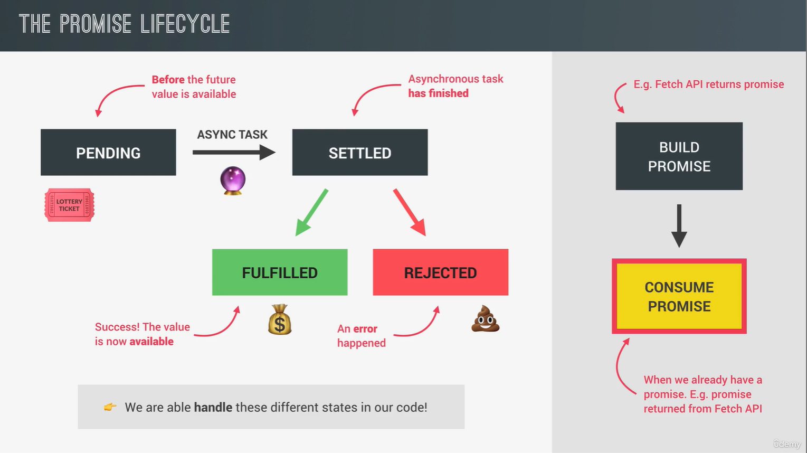

<!--
 * @Author: _krill
 * @Date: 2022-08-16 20:13:36
 * @LastEditTime: 2022-08-17 18:17:01
 * @Description: 
-->

# asyn JS


## Ajax 调用

### `XMLHttpRequest` (old way)

```js
// 创建请求
const request = new XMLHttpRequest();
// 请求方式 请求链接
request.open('GET', `https://restcountries.com/v3.1/name/${country}`);
// 发送请求
request.send();
```

#### Request and Response

请求-响应模型 / CS 架构


### Promises and Fetch API (modern way)

> 发送多个 Ajax 请求时，无法保证数据到达顺序.
>
> 解决方法：嵌套回调，但回调过多时出现 Callback Hell，ES6 以后使用 Promises 避免回调地狱

Promises 是一个用作异步请求保存未来结果的占位符/容器，或者说异步传递值的容器。

**Promises 优点**

1. 使用 Promises，不需要依赖事件和回调函数来处理异步请求。

2. 使用 Promises，可以创建异步操作序列来保证请求结果按顺序展示，避免回调地狱。

``` js
const getCountryData = function (country) {
    fetch(`https://restcountries.com/v3.1/name/${country}`)
    // 这里的 json() 方法同样是异步，将返回一个新的 Promises
    .then(response => response.json())
    .then(data => renderCountry(data[0]));
}
```


### Chaining Promises

避开 Callback hell，链式扁平化而非嵌套。

``` js
const getCountryData = function (country) {
    fetch(`https://restcountries.com/v3.1/name/${country}`)
    .then(response => response.json())
    .then(data => {
        renderCountry(data[0]);
        const neighbour = data[0].borders[0];

        if(!neighbour) return;
        return fetch(`https://restcountries.com/v3.1/alpha/${neighbour}`);
    })
    .then(response => response.json())
    .then(data => renderCountry(data[0], 'neighbour'));
}
```

### 处理 Rejected Promises

通过向 ferch().then() 传递第二个函数参数作为错误处理函数；或者更优解添加 `.catch()` ，其将顺着 Promises 链捕获出现的错误，例如出现离线情况.

但如果请求返回结果 404，仅仅是 `.catch` 不会自动捕获，此时应手动抛出错误.

```js
const getCountryData = function (country) {
    fetch(`https://restcountries.com/v3.1/name/${country}`)
        .then(response => {
            if(!response.ok) 
                throw new Error(`Country not found ${response.status}`);    
            return response.json()
        })
        .catch(err => renderError(`Something went wrong! ${err.message}, Try again!`))
        .finally(() => {
            countriesContainer.style.opacity = 1;
        });
}
```

### Build a simple promise

```js
// Promise 接收一个函数参数：执行者函数 executor
const createImage = function (imgPath) {
    return new Promise(function (resolve, reject) {
        const img = document.createElement('img');
        img.src = imgPath;

        img.addEventListener('load', function() {
            imgContainer.append(img);
            resolve(img);
        });

        img.addEventListener('error', function() {
            reject(new Error(`Image not Found`));
        })
    });
};
```

### 异步函数 async/await【ES2017】

即使异步函数内部出现错误，最后返回的仍然是 fulfilled。所以应在异步函数的 catch 内继续抛出向上错误。

```js
// async 异步调用最后返回一个 Promise
const whereAmI3 = async function (country) {
    try {
        // await 直到得到结果 fulfilled【then 的语法糖】
        const res = await fetch(`https://restcountries.com/v3.1/name/${country}`);
        const data = await res.json();
        renderCountry(data[0]);
    } catch (err) {
        renderError(`${err.message}`);
        // Reject promise returned from async function
        throw err;
    }
    
}
whereAmI3().then(res => console.log(res)).catch(err => console.error(`${err.message}`));
```
**await 只能在异步函数中使用**，使用 **IIFE** 将以上全部变成异步函数。

``` js
(async function() {
    try {
        const city = await whereAmI3();
        console.log(city);
    } catch(err) {
        console.error(`${err.message}`);
    }
    console.log('3: finally do');
})();
```
### Promise 组合器

#### Promise.all

在同时获取多个数据，且获取顺序并不重要时，使用 `Promise.all()` 将多个 Promise 组合在一起进行，当其中任意一个 Promise 被 reject 会发生短路，抛出错误。

```js
const get3Countries = async function (c1, c2, c3) {
    try {
        const data = await Promise.all([getJSON(`https://restcountries.com/v3.1/name/${c1}`),
        getJSON(`https://restcountries.com/v3.1/name/${c2}`),
        getJSON(`https://restcountries.com/v3.1/name/${c3}`)]);
        console.log(data);
    } catch (err) {
        console.error(err.message);
    }
}
```

#### Promise.race

`Promise.race()` 接收一组 Promises，并且返回一个 Promise，当接收的其中一个 Promise fulfilled 则返回且只返回该 Promise。

```js
(async function () {
    const res = await Promise.race([getJSON(`https://restcountries.com/v3.1/name/italy`),
    getJSON(`https://restcountries.com/v3.1/name/egypt`),
    getJSON(`https://restcountries.com/v3.1/name/mexico`)]);
    console.log(res);
})();
```

让请求在指定事件后超时停止加载

```js
Promise.race([
    getJSON(`https://restcountries.com/v3.1/name/italy`),
    timeout(0.1),
])
.then(res => console.log(res[0])
.catch(err => console.error(err)));
```

#### Promise.allSettled 【ES2020】

`Promise.allSettled` 返回所有请求的结果，不会短路，无论该组 Promises 中的 Promise 是否被接受。

```js
Promise.allSettled([
    Promise.resolve('Success'),
    Promise.reject('ERROR'),
    Promise.resolve('Success'),
]).then(res => console.log(res));
```

#### Promise.any 【ES2021】

`Promise.any` 忽略被拒绝的请求，返回第一个被接受的请求。

```js
Promise.any([
    Promise.reject('ERROR'),
    Promise.resolve('Success1'),
    Promise.resolve('Success2'),
]).then(res => console.log(res));
```

## 非阻塞并发

事件循环使得回调函数进入调用堆栈执行

使用常规方法异步的过程和使用 Promises 进行异步的过程基本相似，不同的是它们的回调函数进入不同的队列，前者直接进入回调队列，后者进入微任务队列，**微任务队列的优先级永远比回调队列高**。也就是说如果微任务队列始终有回调等待执行，回调队列将被饿死。

加载资源等异步过程都将在 Web APIs 环境中进行，而不是在主进程（调用堆栈）。

对于常规方法异步，注册的回调函数也将在 Web APIs 环境中等待，当资源加载完成后，回调函数将进入回调队列。此时事件循环作用，**当调用堆栈为空（除 Global Content）时**，它将从回调队列调用函数进入调用堆栈运行。由事件循环来对回调先后顺序进行编排。

对于 Promises，回调函数将进入微环境队列，之后过程与常规方法一致。

DOM 事件虽然不是真正的异步，但同样会使用回调队列以运行其附加的回调。

```js
console.log(`Test start`);
setTimeout(() => console.log('0 sec time', 0));
// 创建一个 Promises 并且立即解决
Promise.resolve(`Resolved promise 1`)
    .then(res => {
        for(let i = 0; i < 100000; i++) {}
        console.log(res);
    });
console.log(`Test end`);

---
outputs:
Test start
Test end
Resolved promise 1
0 sec time 0
```