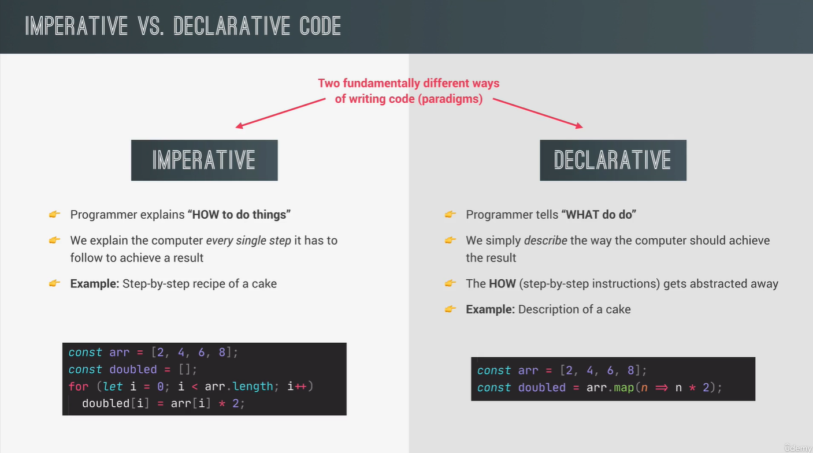

<!--
 * @Author: _krill
 * @Date: 2022-08-18 15:34:00
 * @LastEditTime: 2022-08-18 22:51:40
 * @Description: 
-->
# Modern Js Technique

## Module 

模块是可重复使用并隐藏实现细节的独立文件，各模块可以实现完全隔离开发。

### ES6 Module & Script 区别


当导入其他模块变量或函数时，导入模块的全过程发生在主模块中的代码之前执行。模块导入是异步发生，**导出的数据是引用而非拷贝**，当值在导出模块中改变时，同样会在导入模块中变化。

### 导入和导出

导入模块

```js
import { addToCart, totalPrice as price, totalQuantity} from "./shoppingCart.js";

// default
import add from "./shoppingCart";
```

导出模块，每个模块只有一个默认导出

```js
export const addToCart = function (product, quantity) {
    cart.push({ product, quantity });
    console.log(`${quantity} ${product} added to cart`);
}

const totalPrice = 230;
const totalQuantity = 1000;

export { totalPrice, totalQuantity };

export default function (product, quantity) {
    cart.push({ product, quantity });
    console.log(`${quantity} ${product} added to cart`);
}
```

## Top-level await 【ES2022】

模块使得我们可以在异步函数之外使用，称为 `Top-level await`，但该异步行为会阻止整个模块的执行，同样会阻塞导入模块的代码运行。

```js
// script.js
const res = await fetch('https://jsonplaceholder.typicode.com/posts');
const data = await res.json();
console.log(data);
console.log(`Something end`);
```

应用场景

```js
const getLastPost = async function () {
    const res = await fetch('https://jsonplaceholder.typicode.com/posts');
    const data = await res.json();
    console.log(data);
    return {title: data.at(-1).title, text: data.at(-1).body};
};

const lastPost = getLastPost();
// 得到结果 Promise{<pending>}
console.log(lastPost); 
// Not very Clean
lastPost.then(last => console.log(last));

// 使用 Top-level await✅
const lastPost2 = await getLastPost();
```

## Module Pattern

封装私有数据，开放公共 API

```js
const ShoppingCart2 = (function() {
    const cart = [];
    const shippingCost = 10;
    const totalPrice = 237;
    const totalQuantity = 23;

    const addToCart = function (product, quantity) {
        cart.push({ product, quantity });
        console.log(`${quantity} ${product} added to cart is ${shippingCost}`);
    }

    const orderStock = function (product, quantity) {
        cart.push({ product, quantity });
        console.log(`${quantity} ${product} ordered from supplier`);
    }
    return {
        addToCart,
        cart,
        totalPrice,
        totalQuantity,
    }
})();

// 闭包
ShoppingCart2.addToCart('apple', 3);
console.log(ShoppingCart2);
console.log(ShoppingCart2.shippingCost); // ❌
```

## CommonJS Modules

```js
// Export 导出
export.addToCart = function (product, quantity) {
    cart.push({ product, quantity });
    console.log(`${quantity} ${product} ordered from supplier`);
};

// Import 导入
const {addToCart} = require('./shoppingCart.js');
```

## NPM

包管理工具

```shell
# 下载 package.json 指定的包
npm i
# 下载指定的包
npm i <packageName>
# 卸载
npm i <packageName>
```

### parcel

模块捆绑器

```shell
# 安装
npm i parcel --save-dev
# 启动方法 1 npx
npx parcel index.html
# 启动方法 2 在 package.json 添加
  "scripts": {
    "start": "parcel index.html"
  },
# 命令行
npm run start
```

**热模块替换：**当我们修改其中的任意模块时，将会触发重构并注入修改后的模块但不会使得整个页面重新加载。

```js
if(module.hot) {
    module.hot.accept();
}
```

最终压缩版本包

```json
"scripts": {
    "start": "parcel index.html",
    "build": "parcel build index.html"
  },
```

```shell
npm run build
```

## Babel & Polyfilling

Babel 将当前代码编译回到 ES5，Babel 只能将 ES6 的语法转换回到 ES5，但对于 ES6 中新增的功能和特性无法被转译。

Babel 中有插件和预设，插件是独立的可设置需要那类语法回到 ES5。预设是一系列捆绑的插件，根据需要支持的浏览器版本并将该部分自动编译。

Polyfilling 可以将 ES6 的功能和特性转译回到 ES5，实际上是重新创建定义这些新的功能特性，使得它们可以在捆绑包中使用。

```js
// import 'core-js/stable';
import 'core-js/stable/array/find';
// Polifilling async function
import 'regenerator-runtime/runtime';
```

## Modern And Clean Code

1. 可读性强，函数和变量命名清晰

2. DRY 原则

3. 不要污染全局变量空间，不要使用 `var` 定义变量

4. 总是使用强类型检查 `===`

5. 单一职责原则，每个函数只做一件事，函数参数不要超过三个，尽量使用默认参数

6. 确保数据隐私和封装，开放公共 API

7. 推荐在回调函数中使用箭头函数，避免在对象中使用箭头函数

8. 避免嵌套代码，扁平化

9. 尽量使用 `map, reduce, filter` 替代 `for/for-of`

10. 避免基于回调的异步函数，优先使用 `async/await` 接收 `Promises` 替代 `then/catch`

11. 异步请求的顺序并无影响时，尽量使用 `Promise.all` 等组合器，提高效率

## 声明式 & 函数式编程

两大范式：命令式编程、声明式编程



声明式编程是现代 Js 以及当下非常流行的趋势，函数式编程便是其子范式。函数式编程通过组合多个纯函数，避免副作用和变异数据。

- **副作用**：修改函数以外的任何数据

- **纯函数**：不会产生副作用，不依赖任何外部变量

- **不变性**：**状态（数据）完全不可变**，创建副本再返回而非直接修改，其使得数据更容易跟踪


`Object.freeze()` 冻结对象，防止修改和添加新的数据。只冻结对象的第一级，不进行深度冻结。
