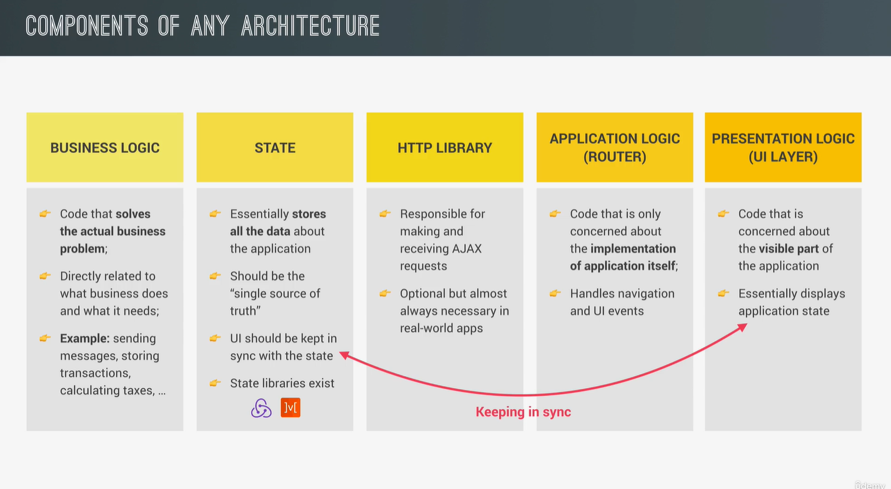
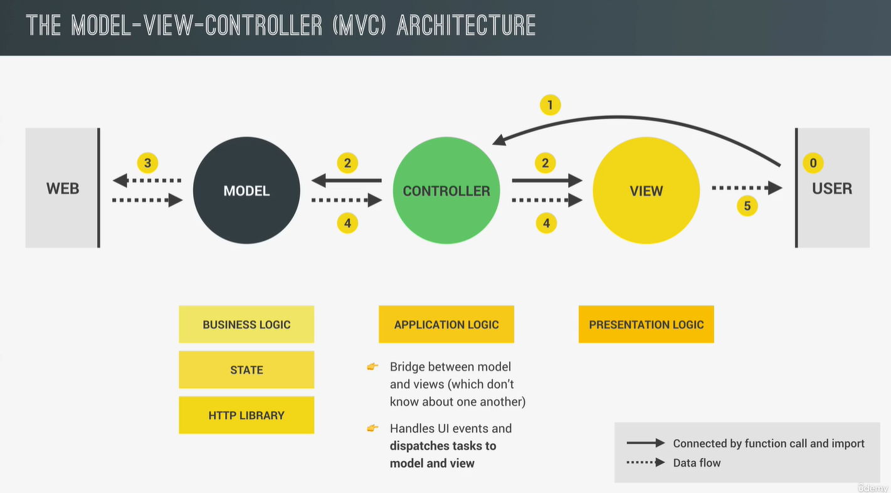
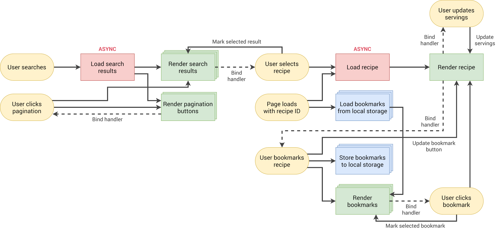

<!--
 * @Author: _krill
 * @Date: 2022-08-19 13:10:22
 * @LastEditTime: 2022-08-31 20:08:55
 * @Description: 
-->

# Final Project【Forkify】

## MVC





## 发布-订阅者模式

观察者模式（Observer Pattern）
观察者模式定义了对象间的一种一对多的依赖关系，当一个对象的状态发生改变时，所有依赖于它的对象都将得到通知，并自动更新。观察者模式属于行为型模式，行为型模式关注的是对象之间的通讯，观察者模式就是观察者和被观察者之间的通讯。

发布订阅模式（Pub-Sub Pattern）

在现在的发布订阅模式中，称为发布者的消息发送者不会将消息直接发送给订阅者，这意味着发布者和订阅者不知道彼此的存在。在发布者和订阅者之间存在第三个组件，称为消息代理或调度中心或中间件，它维持着发布者和订阅者之间的联系，过滤所有发布者传入的消息并相应地分发它们给订阅者。

### 区别

观察者模式： 观察者（Observer）直接订阅（Subscribe）主题（Subject），而当主题被激活的时候，会触发（Fire Event）观察者里的事件。

发布订阅模式： 订阅者（Subscriber）把自己想订阅的事件注册（Subscribe）到调度中心（Topic），当发布者（Publisher）发布该事件（Publish topic）到调度中心，也就是该事件触发时，由调度中心统一调度（Fire Event）订阅者注册到调度中心的处理代码。

## 项目总结

Forkify 食谱项目使用 MVC 模式，实现了食谱查看、搜索、收藏以及添加个人食谱四个主要功能。

Model 层封装了食谱、搜索结果列表、书签列表三个主要数据，负责数据的交互；

View 层负责数据渲染，加载到界面，DOM 操作；

Control 层是程序入口，M 和 V 层的交互控制，所有事件的监听和响应；

首先实现的是搜索功能，用户输入关键字，异步发起请求并渲染搜索结果，用户选择搜索结果列表的食谱后，异步加载渲染食谱。

第二个实现的是换页功能，使用懒加载，将搜索结果分页，无需一次渲染所有结果到页面中，提高性能。

进一步我们实现收藏功能，用户选择食谱后可在界面点击收藏，此时需要完成三个步骤，其一修改当前食谱属性，并将该对象本地存储；其二将该食谱对象添加到书签列表；其三，在书签列表和当前界面渲染已收藏标记。

最后我们实现添加食谱功能，用户点击添加按钮后输入新食谱数据，点击提交后进行数据检验，添加到食谱库中并且作为私人食谱默认添加到书签列表收藏。当用户搜索查看该食谱时，将会显示特殊标记以表示为用户私人食谱。

在每一个 Feature 完成后及时进行重构，非常有利于代码的可复用性和可拓展性。

### 架构图 & 流程图





## JSdoc [jsdoc.app]

**eg. render(View.js)**

```doc
/**
* 将接收的对象渲染到 DOM
* @param {Object | Object[]} data 渲染的数据如食谱 
* @param {Boolean} [render=true] 如果为 False,只创建标记而不渲染
* @returns {undefined | string} 如果 render 为假，返回标记
* @this {Object} View instance
* @author Gaffey
* @todo Finish implementation
*/
```

## 改进

1. 在分页按钮之间显示当前页数

2. 对于搜索结果给予更多的排序选项

3. 提交表单前进行格式验证和提醒

4. 购物清单功能，添加成分到配方清单

5. 每周膳食计划

6. 获取营养成分数据，【spoonacular API】
